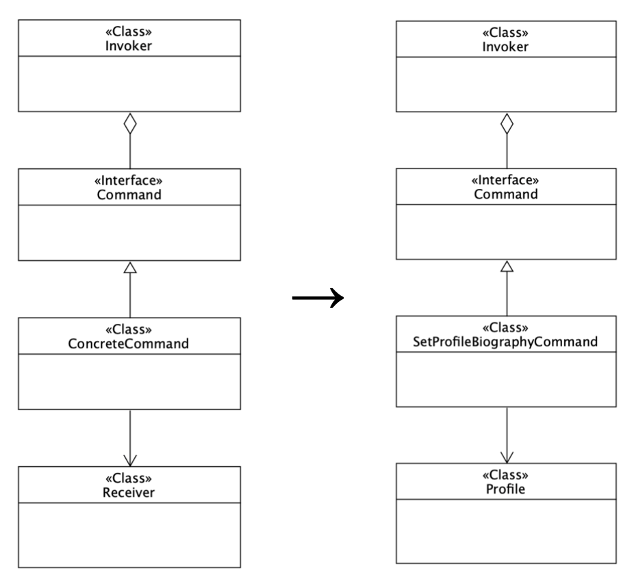

# Java Command Design Pattern
Complete example of the command design pattern in `Java 10+`

The implementation includes 5 classes. In the example in the repository, `Profile` has a `biography`. The class `SetProfileBiographyCommand` wraps the `Profile`'s `setBiography()` method. The `Profile` is a instance of `Receiver`.

The `main()` method in the `Main` class includes an example where a biography is set a couple of times and then the set is undone, discarding the made changes.

The image below shows how the design command pattern maps to the examples used in this repository.

## License

See LICENSE.md for more information.
